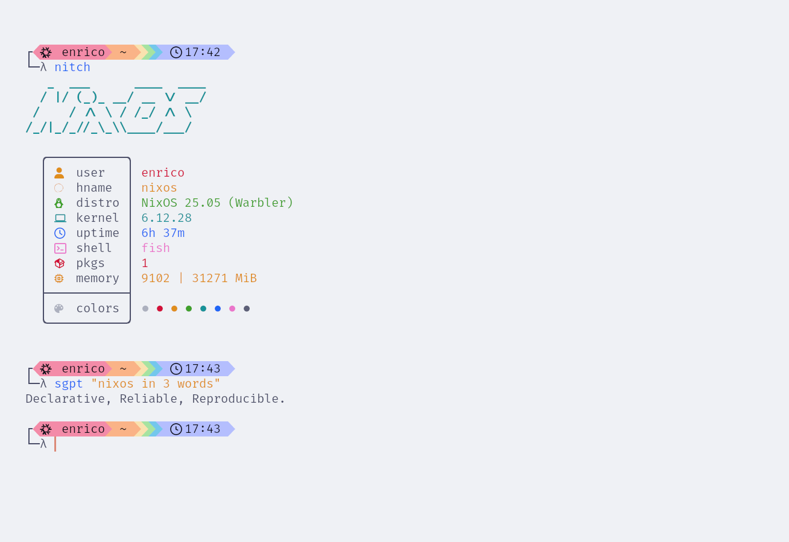

# My NixOS Configurations

This repository contains my personal NixOS configurations, managed using Nix Flakes.

## Structure

```
.
├── flake.nix          # Main Nix Flake file
├── machines/            # Machine-specific NixOS configurations
│   ├── desktop/
│   ├── laptop/
│   └── web-services/
├── home/                # Home Manager configurations
│   ├── default.nix
│   └── ...
├── modules/             # Custom NixOS modules
│   ├── core.nix
│   └── ...
├── config/              # Other configurations (e.g., macOS)
│   └── darwin/
└── scripts/             # Utility scripts
    └── ...
```

## BOOTABLE STICK


lsblk

sudo dd bs=4M conv=fsync oflag=direct status=progress if=<path-to-image> of=/dev/sdX

## Usage

These configurations are primarily for my personal use. However, feel free to browse the code and adapt any parts that you find useful for your own NixOS or Home Manager setup.


## License

This repository is licensed under the [MIT License](LICENSE).